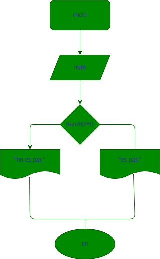

# par_impar
construir un programa que lea u numero entero y que determine si se trata de un numero  par o impar
## input
num: variable de entrada
## processing
### formula
num%2=0
si es 0 es par
si es 1 es impar
## diseño

